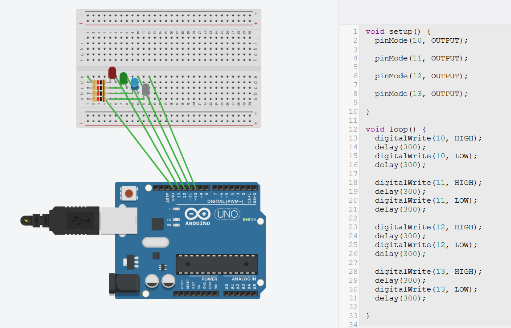
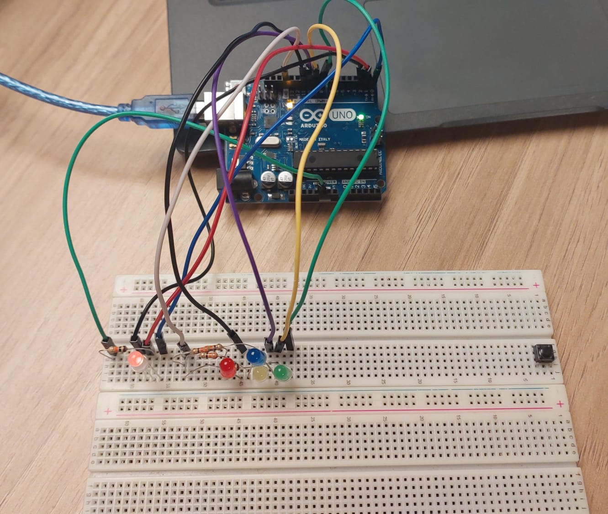

# Ponderada-Arduino-UNO

Segue link do video do arduino funcionando:
https://youtu.be/gKJVif3j-zc



https://www.tinkercad.com/things/g9ComeIuFhz-arduino-caua



Codigo utilizado:

```
int redPin = 0;
int greenPin = 1;
int bluePin = 2;

void setup() {
  pinMode(11, OUTPUT); // define o pino 13 como saída
    
  pinMode(10, OUTPUT); // define o pino 13 como saída
   
  pinMode(9, OUTPUT); // define o pino 13 como saída

  pinMode(8, OUTPUT); // define o pino 13 como saída

  pinMode(redPin, OUTPUT);
  pinMode(greenPin, OUTPUT);
  pinMode(bluePin, OUTPUT);

}

void loop() {

  digitalWrite(redPin, HIGH);
  delay(300);
   digitalWrite(redPin, LOW);
  delay(300);

digitalWrite(greenPin, HIGH);
   delay(300);
digitalWrite(greenPin, LOW);
   delay(300);

digitalWrite(bluePin, HIGH);
  delay(300);
digitalWrite(bluePin, LOW);

  digitalWrite(redPin, HIGH);
  delay(300);
   digitalWrite(redPin, LOW);
  delay(300);

digitalWrite(greenPin, HIGH);
   delay(300);
digitalWrite(greenPin, LOW);
   delay(300);

digitalWrite(bluePin, HIGH);
  delay(300);
digitalWrite(bluePin, LOW);

  digitalWrite(redPin, HIGH);
  delay(300);
   digitalWrite(redPin, LOW);
  delay(300);

digitalWrite(greenPin, HIGH);
   delay(300);
digitalWrite(greenPin, LOW);
   delay(300);

digitalWrite(bluePin, HIGH);
  delay(300);
digitalWrite(bluePin, LOW);
  

  digitalWrite(11, HIGH); // acende o LED
  delay(300);            // espera 1 segundo
  digitalWrite(11, LOW);  // apaga o LED
  delay(300);            // espera 1 segundo

  digitalWrite(10, HIGH); // acende o LED
  delay(300);            // espera 1 segundo
  digitalWrite(10, LOW);  // apaga o LED
  delay(300);            // espera 1 segundo

  digitalWrite(9, HIGH); // acende o LED
  delay(300);            // espera 1 segundo
  digitalWrite(9, LOW);  // apaga o LED
  delay(300);            // espera 1 segundo

  digitalWrite(8, HIGH); // acende o LED
  delay(300);            // espera 1 segundo
  digitalWrite(8, LOW);  // apaga o LED
  delay(300);            // espera 1 segundo

}

void setColor(int red, int green, int blue) {
  analogWrite(redPin, red);
  analogWrite(greenPin, green);
  analogWrite(bluePin, blue);
}

```
